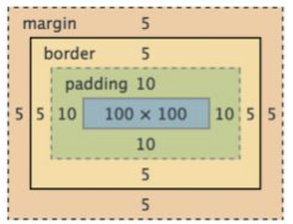

# position과 좌표 레이아웃
좌표속성
---
> css
```css
.box {
  top : 20px;
  left : 30%;
}
```
- top, left, bottom, right 속성을 사용하면 요소의 상하좌우 위치 변경 가능

    - 이 좌표속성을 사용하려면 position 속성이 필요

        - position 속성은 좌표속성을 적용할 기준점을 지정해주는 역할

 
<br>
 
---

<br>
 

position 속성
---
> css
```css
.box {
  position : static;    /* 기준이 없음 (좌표적용 불가) */
  position : relative;  /* 기준이 내 원래 위치 */
  position : absolute;  /* 기준이 내 부모 */
  position : fixed;     /* 기준이 브라우저 창 (viewport) */
}
```
- 여기서 원하는 기준을 선택하면 좌표속성으로 좌표 값을 줄 수 있음

- position : absolute

  - 부모 박스를 기준으로 찰싹 달라붙은 뒤에 좌표값을 적용 

    - 정확히 말하면 부모 중에 position : relative 를 가지고 있는 부모가 기준 

- position : fixed

  - 현재 화면을 기준으로 고정되는 요소가 필요할 때 사용

 
<br>
 
---
 
<br> 

position : absolute 를 적용한 요소 가운데 정렬 
---
> css
```css
.button {
  position : absolute; 
  left : 0;
  right : 0; 
  margin-left : auto;
  margin-right : auto;
  width : 적절히
}
```
- 적어도 5개의 속성이 있어야 가운데 정렬이 가능

<br>

---

<br>

겹치는 박스 만들기
---
- position 속성 사용하

  - absolute, relative, fixed 중 하나 사용 

<br>


### 박스를 만들 때 주의점
- 원래 div 박스에 width를 주게되면 padding, border 고려 X

  - width 는 content 영역의 너비를 의미

  - padding 안쪽 부분만 실제 width 로 설정

   - 200px의 박스를 만들어도, padding 을 많이 주게 되면 실제 보여지는 박스의 폭이 padding 만큼 늘어남

> 이미지 참고

|-|
|-|
||
|- 파란색 부분만 실제 width| 

<br> 

## 박스의 폭을 border까지 설정해주고 싶을 때 쓰는 속성 

> css
```css
.box {
  box-sizing : border-box;  /*박스의 폭은 border까지 포함*/
  box-sizing : content-box; /*박스의 폭은 padding 안쪽*/
}
```
- box-sizing 속성 : border 까지를 실제 박스의 폭으로 설정 

<br>
 
---

<br>

CSS 파일 작성시 기본으로 쓰면 좋을 속성들
---
- 숙련자들의 CSS 파일을 보면 아래 내용을 맨 위에 정의하고 시작
> css
```css
div {
  box-sizing : border-box;
}
body {
  margin : 0;
}
html {
  line-height : 1.15; /*기본 행간 높이*/
}
```
- 그 외 자주 사용하는 설정

  - 모든 h, p 태그의 margin을 균일하게 설정

  - li, a 태그에 text-decoration : none

  - table 태그에 border-collapse: collapse

- 미리 적고 시작하면 항상 편리하게 CSS 코드를 짤 수 있음

  - CSS Reset 이라 부르기도 함

<br>

💡 기본으로 복붙하고 시작할 "필수 기본값 CSS 리스트"를 하나 만들어두고 업데이트 해보기 

<br>

---

<br>

CSS normalize
---
- 브라우저간 통일된 스타일을 주기 위해 특정 스타일을 맨 위에 적고 CSS 작성하는 경우

  - [CSS Normalize 링크](https://github.com/necolas/normalize.css/blob/master/normalize.css) 참고

    - 여기있는 스타일 붙여넣으면 브라우저간 다르게 보이는 문제들 미리 해결 가능

    - 스타일을 그대로 css 파일에 복붙 or 다운받아서 <link> 태그로 첨부


> 사용 이유
```
브라우저마다 <button>의 스타일이 다르고, line-height (줄간격)도 다르고 <input> 사이즈도 다르기 때문

  → 같은 코드를 짜도 다른 브라우저에선 이상하게 보일 수 있음
```
 

<br>

