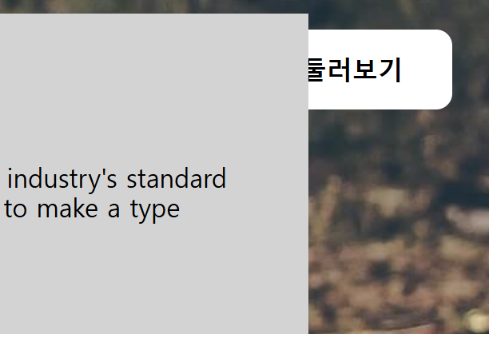

# 반응형 width

z-index
---
- position 사용하면 공중에 붕 뜨게 됨

    - 공중에 떠있는 것이 많으면 누가 가장 앞에 올 것인가를 지정

- 정수로 입력

    - 숫자가 높을수록 앞에 위치

<br>

> css
```css
.main-btn{
    position: absolute;
    bottom: 140px;
    right: 130px;
    z-index: 5;     /* 추가 */
}
```

> 결과

|전|후|
|-|
|||

<br>

---

<br>

max-width
---
- 반응형 웹페이지를 만들 때 % 사용

    - ex. 가변적인 폭을 주고 싶다면 width 에 % 사용해 부모 width 의 \~% 적용

    - 그러나 PC 사이즈에서는 너무 클 수 있음

        - max-width : 최대 폭 제한으로 width % 와 함께 사용하면 문제 해결

        - max-height, min-width 등 다양함


<br>