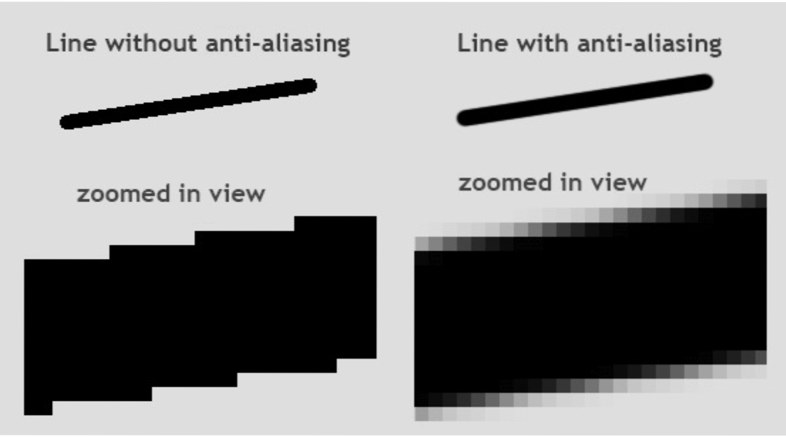

# HTML CSS 웹폰트 넣는 법과 안티앨리어싱

폰트 패밀리 설정법 
---
> css
```css
body {
  font-family : 'gulim', 'gothic'
}
```
- 버그없이 사용하려면 폰트의 영문명 사용

- 폰트명에 띄어쓰기가 있을 수 있으니 따옴표 안에 담기

- 폰트명을 콤마로 여러개 쓰면 제일 왼쪽에 있는 폰트부터 적용

    - 실패하면 뒤에 있는 폰트들을 차례로 적용

- 웹사이트 이용자의 컴퓨터에 설치가 된 폰트들 적용 가능

<br>

---

<br>

사용자의 컴퓨터에 설치되지 않은 폰트를 사이트에서 이용하려면 
---
> css
```css
@font-face {
  font-family : '적용할폰트';
  src : url(nanumsquare.ttf)
}
```
- CSS파일 최상단에 @font-face 라는 명령어를 넣고, url() 안에 적용할 폰트의 경로와 이름 기재

    - css파일과 같은 폴더에 있을 경우, 경로는 nanumsquare.ttf 라고 기재 

- 클래스에서 font-family : '적용할폰트' 쓰면 nanumsquare.ttf 폰트를 적용

<br>

---

<br>

웹폰트용 woff파일 
---
- 웹폰트용으로 나온 woff 파일

    - ttf에 비해 용량이 3분의1 수준

- 한글폰트 ttf 파일은 용량이 매우 큼 (한글폰트는 특히 몇천자가 들어있기 때문에)

    - 구할 수 있다면 woff 파일을 사용하는걸 추천
    
    - ttf와 호환성은 거의 비슷한 수준

- IE8 이하에선 적용 X 

- [나눔스퀘어 woff 버전](https://github.com/moonspam/NanumSquare)

<br>

---

<br>

IE 옛 버전에서도 호환성 좋게 폰트를 사용하려면
---
> css
```css
@font-face { 
  font-family: 'NanumSquare'; 
  font-weight: 400; 
  src: url(NanumSquareR.eot); 
  src: url(NanumSquareR.eot?#iefix) format('embedded-opentype'), 
      url(NanumSquareR.woff) format('woff'), 
      url(NanumSquareR.ttf) format('truetype'); 
}
```
- eot, woff, ttf 파일들을 구한 후 이렇게 첨부

<br>

---

<br>

폰트를 빠르게 사용하기 위한 Google Fonts
---
- [구글폰트](fonts.google.com) 사이트 이용하면 폰트파일을 구하지 않아도 됨

    - Google Fonts 사이트에서 바로 폰트파일과 CSS 정의부분 링크 가능

- 사이트에서 원하는 폰트를 고른 후 

    - HTML에 첨부하고 싶다면 <link>로 시작되는 부분을 복붙

    - CSS에 첨부하고 싶다면 @import 로 시작되는 부분을 CSS 맨 위에 복붙

- 구글이 호스팅해주는 폰트가 미리 정의된 CSS 파일을 가져다 쓰는 것

    - 장점 : 내 사이트의 트래픽을 절약할 수 있음

- 크롬브라우저는 이미 방문한 사이트는 캐싱 → 많은 사람들이 이용할 수록 더 빠르게 폰트 이용 가능

<br>

---

<br>

폰트 Anti-aliasing 에 대해
---

|-|
|-|
|| 
|오른쪽이 안티앨리어싱 적용했을 때|

- 앤티앨리어싱

    - 그 픽셀의 각진 부분을 스무스하게 바꿔줌

    - ex) 맥으로 웹개발시 폰트 뭘 쓰든 예뻐보임

        - 굴림, 돋움 같은 기본 폰트도 앤티앨리어싱이 되어서 부드럽게 나옴

- 윈도우에서 돋움, 굴림 폰트를 매우 작게 축소하거나 아니면 매우 크게 확대했을 때 매우 각져보임

    - 해결하고 싶다면 웹상의 글자를 살짝 돌리기(transform)


<br>

> css
```css
transform : rotate(0.04deg); 
```
- transform : 요소를 살짝 회전시키는 스타일

    - 글자를 정말 매우 살짝 회전시키면 윈도우에선 안티앨리어싱 된 듯한 느낌을 줌

 
<br>
 