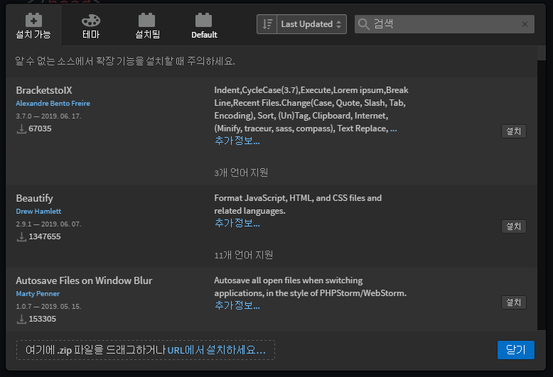
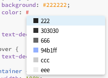

HTML CSS 코드짤 때 유용한 Emmet 그리고 부가기능들
---

- HTML 창작 능력을 빠르게 도와줄 몇가지 부가기능


<br> 

부가기능 설치방법 
---
|-|
|-|
||

- Brackets의 경우 파일 - 확장기능 관리자를 클릭

    - 원하는 부가기능을 검색 후 설치버튼 클릭

- Brackets 부가기능 서버 다운될 경우 [여기](https://registry.brackets.io/)서 직접 찾아 다운로드 후 드래그


- VScode의 경우 제일 왼쪽 메뉴에서 Extension 버튼 클릭

    - 원하는 부가기능을 검색 후 설치버튼 클릭
 

<br>

---

<br>

Beautify 
---
- 코드를 예쁘게 정렬하고싶을 때 사용하는 부가기능

    - Brackets의 경우 설치하면 우측에 마법봉이 하나 생기는데 누르시면 코드 예쁘게 정렬

    - VScode 에디터는 설치할 필요 없이 그냥 우클릭해서 Format Document

<br>

---

<br>

Emmet 
---
- 셀렉터를 이용해서 HTML을 조금 쉽게 생성할 수 있는 부가기능

- VScode는 설치 안해도 요즘은 기본적으로 셋팅되어 있음

> html
```html 
 div.container>div
```
- 입력 후 tab키

> html
```html
<div class="container">
  <div></div>
</div>
```
- HTML 생성 완료

- 생각한 HTML 레이아웃을 CSS 셀렉터처럼 작성 후에 tab키 

    - \> 표시는 내 바로밑의 자식요소라는 뜻

<br>

> html
```html
 div#header>p.title*3
```
- 작성 후 tab

> html
```html
<div id="header">
  <p class="title"></p>
  <p class="title"></p>
  <p class="title"></p>
</div>
```
- p.title : p태그인데 class명이 title인 CSS 셀렉터 문법

- div#header : div태그인데 id명이 header인 CSS 셀렉터 문법

- *3 : 3개씩 생성하라는 뜻

<br>

> css
```css
m10
```
- 작성 후 tab

> css
```css
margin : 10px
```
- 자동생성

- mt10 : (margin-top : 10px)

- w100% : (width : 100%)


<br>

- 그 외 유용한 기능

    - ! 입력후 tab 누르기 (html 문서 시작템플릿 바로 생성)

    - lorem 입력 후 tab 누르기 (임시글자 무작위 생성)

    - \<p> 이렇게 치는게 아니라 p 입력하고 바로 탭키 눌러서 <p> 생성

<br>

#### 💡 div가 몇개 있을 지 먼저 생각하기 어려운 상황
- 더욱 더 사용하도록 연습

- 레이아웃을 머릿속으로 생각해보는 과정 중요

    - div가 몇개 필요할지

    - 여기 글은 p태그로 쓸지 h1으로 쓸지

    - 클래스 명은 뭘로 할지

- Emmet 문법 연습하다보면 자연스럽게 div와 class 구조를 생각

    - 레이아웃 짜는 능력도 상승

<br>

> 작성 순서
```
1. 샘플 디자인 위에 네모박스부터 그려보고 네모박스가 필요한 곳에 div 박스 배치

2. class 명 채워넣기

3. 스타일을 입히기
```

 
<div>

---

<dic>
 
 

테마 
---
- 컴퓨터의 밝은 화면은 눈건강에 좋지 않음

    - 어두운 테마를 설치하면 보다 오래 코딩 가능

- 테마란에 들어가 어두운 테마 하나 아무거나 설치

    - 메뉴에서 보기 - 테마를 누른 후 테마를 선택

<br>

---

<br>

Power Mode 부가기능
---
- 코드를 입력할 때 효과 발생

- 설치랑 셋팅법은 구글 검색

<br>

---

<br>


Color Hints
--- 

|-|
|-|
||

- 색상넣는 자리에 # 까지만 입력하면 내가 위에서 사용했던 색상 힌트를 보여줌

<br>
