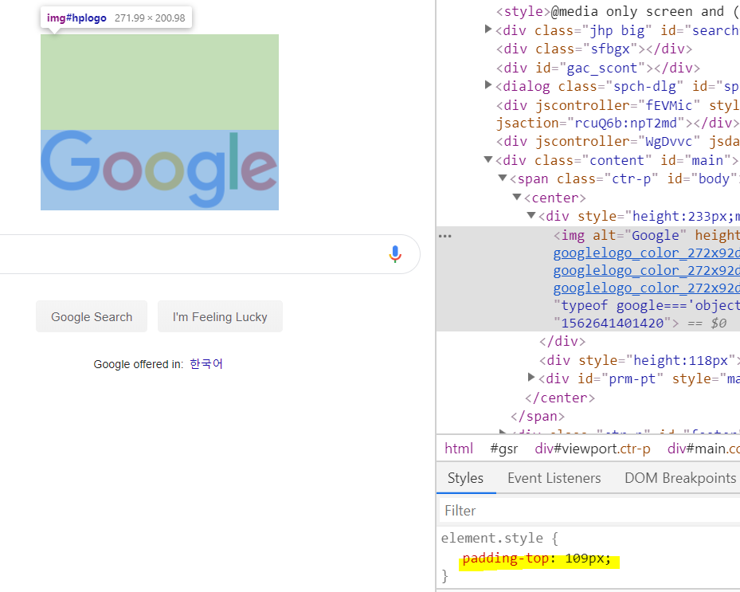
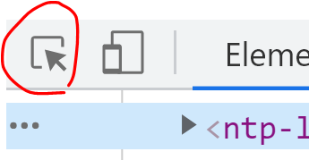
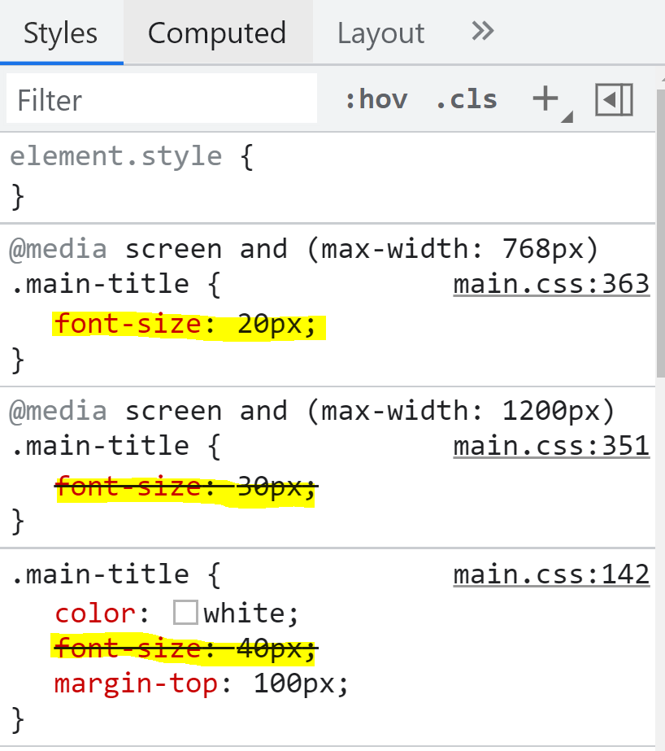
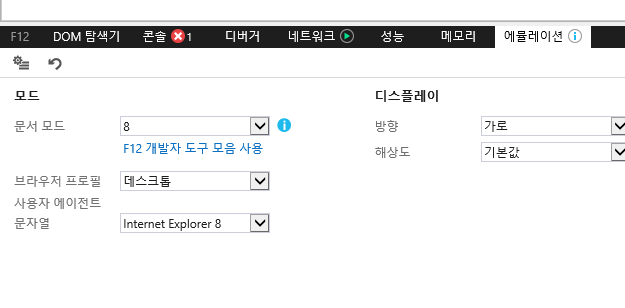

# 개발자도구 잘쓰기, 브라우저 호환성

CSS 버그 발생시
---
- css 파일부터 확인 → 오래 걸림

- 크롬 개발자도구 확인

<br>

---

<br>

크롬 개발자 도구를 열면 버그 수정이 편해짐
---
 
|-|
|-|
||
 
- 브라우저에서 우클릭 - 검사

    - HTML과 CSS를 한눈에 볼 수 있음

- F12 눌러서 개발자도구 오픈 (맥은 alt + command + i)

 

<br>

### 선택하여 검사

|-|
|-|
||
|위 버튼을 누르고 검사를 원하는 요소를 선택|

- 선택하면 우측 하단에 지금 선택한 요소에 적용된 모든 스타일을 보여줌

- 그 중에 어떤 속성을 만져야 수정이되는지 직접 조작해보며 확인 가능

 
<br>
 
### style

|-|
|-|
||

- 여러 개의 중복 스타일이 있을 경우 가장 우선 적용되는 것을 맨 위에 보여줌

    - 나머지 적용안되는 것들은 취소선 처리

- html에 적용되는 여러개의 class가 있으면 전부 보여줌

    - 가장 위에 있을 수록 class의 우선순위가 높음

- 해당 창에서 직접 스타일을 수정하며 테스트 가능

    - 실제 파일에 반영 X

<br>

---

<br>

예전 인터넷 익스플로러 브라우저에서 미리보기 
---
- CSS 속성들 중엔 예전 브라우저에서 지원하지 않는 속성들 존재

- 해당 속성 사용하면 IE8, IE9 브라우저들에선 사이트가 이상하게 보일 수 있음

<br>

### 예전 브라우저에서도 호환성을 챙길 수 있는 방법

|-|
|-|
||


- 윈도우10

    - 시작 - 검색창에서 internet explorer 검색

- 윈도우11

    - 직접 internet explorer 11 버전 설치

- 인터넷 익스플로러 11버전을 켠 후 우클릭 - 검사

    - 크롬 개발자 도구와 유사한 메뉴들 확인 가능

        - 에뮬레이션 탭으로 들어가시면 예전 IE 브라우저에서 미리보기 가능

<br>

---

<br>

조건부로 익스플로러 버전용 CSS파일 첨부
---
- 익스플로러 X 버전 이하에서만 적용할 수 있는 CSS파일을 첨부 가능

> html
```html
<!--[if lt IE 9]>
  <link rel="stylesheet" type="text/css" href="css/ie8.css" />
<![endif]-->
```
- css폴더내의 ie8.css 라는 파일은 인터넷 익스플로러 9 미만에서만 적용

- [if lt IE 10] 이렇게 바꾸면 익스플로러 10 미만에서만 적용

- ie8.css에 수정하고 싶은 코드를 담고 head태그 내에 다른 CSS 파일들과 함께 첨부

    - ie8.css 파일은 다른 브라우저에선 전혀 읽지 않음

    - link 태그 첨부 순서는 가장 마지막
    
        - 중요한 덮어쓰기 파일일 수록 밑으로 보내기

<br>
 

 