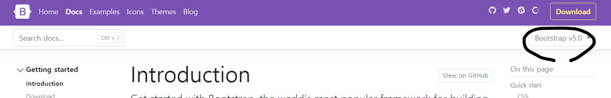

# Bootstrap 설치와 사용법

Boostrap
---
- 프론트엔드 Component Library

- 웹페이지에 필요한 버튼, 메뉴, 탭, 모달, 카드 등 필수 요소들을 모아놓은 일종의 CSS 파일

- HTML 파일에 설치하면 보다 빠른 복붙식 HTML CSS 개발 가능

<br>

|버전 선택|
|-|
||
|IE 호환성 : 3버전은 IE9+ / 4버전은 IE11+ / 5버전은 IE12+ (Edge 브라우저)|

<br>

---

<br>

설치 방법
---
### 방법1
- [방문](https://getbootstrap.com/docs/5.1/getting-started/introduction/#starter-template) 후 Starter Template 이라고 써있는 예제 코드를 HTML 파일에 복붙

<br>

### 안정성있는 설치 방법2
- [방문](https://getbootstrap.com/docs/5.1/getting-started/download/) 후 boostrap.min.css, bootstrap.~.js 파일을 다운받아 HTML 파일에 첨부

> html
```html
<!-- head 태그 안에 CSS 첨부 -->
<link href="bootstrap.min.css 경로" rel="stylesheet">

<!-- body 태그 끝나기 직전에 js 첨부 -->
<script src="bootstrap.어쩌구.js 경로"></script>
```
- \<script> 태그는 \<body> 태그 끝나기 전에 아무데나 넣어주기

<br>

---

<br>

복붙식 개발
---
- [홈페이지 방문](getbootstrap.com)하여 마음에 드는 UI 요소를 골라서 내 HTML 파일에 복붙

- 뼈대 가져온 후 색상이나 레이아웃은 커스터마이징

<br>

---

<br>

Utility Class 사용가능
---

> html
```html
<div class="container">이쁜 여백가진 박스</div>
<div class="mt-5">margin-top 쉽게 주기</div>
<div class="pb-5">padding-bottom 쉽게 주기</div>
<div class="fs-3">font-size 쉽게 주기</div>
<div class="text-center">text-align 쉽게 주기</div>
<div class="fw-bold">font-weight 쉽게 주기</div>
```
- Bootstrap을 설치하면 위 class 들 이용가능

    - 직접 CSS 에다가 padding-bottom 기록할 필요 없이 pb-5 이렇게 주면 끝

        - padding-left 는 ps-5 (start의 약자)

        - padding-right 는 pe-5 (end의 약자)

- 더 필요한 내용은 Bootstrap 홈페이지의 Utility class 메뉴를 찾아보기 

<br>

---

<br>

Bootstrap 사용 이유
---
- 개발 시간 단축

    - 단, 커스텀 스타일이 많아지면 CSS 파일 200kb 용량만 더 차지하고 개발 시간이 별 차이가 없음

- 반응형 레이아웃도 class 복붙식으로 매우 쉽게 만들 수 있음

<br>
