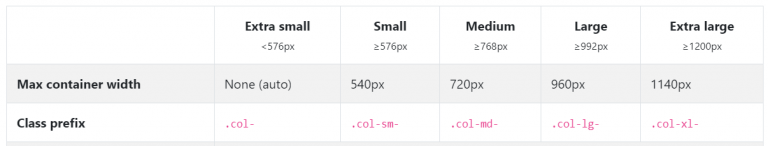

# Bootstrap Grid 레이아웃
- 박스를 균일하게 쪼개고 싶을 때 Bootstrap grid 레이아웃을 사용하면 쉽고 빠르게 구현 가능

    - 균일하거나 불균일하게 가로폭을 쪼개고 싶으면 row와 col 클래스명 사용

> html 
```html
<div class="row">
  <div class="col"> 안녕 </div>
  <div class="col"> 안녕 </div>
  <div class="col"> 안녕 </div>
</div>
```
- 동일한 영역으로 쪼개고 싶을 때 

    - 각각 박스에 col, 그리고 부모에는 row라는 클래스를 부여

    - col-4 이렇게 숫자도 뒤에 적어줘야 함 

 
<br>
 

> html
```html
<div class="row">
  <div class="col-4"> 안녕 </div>
  <div class="col-4"> 안녕 </div>
  <div class="col-4"> 안녕 </div>
</div>
```
- 가로폭을 정확히 3등분할 수 있는는 코드 → 숫자가 4인 이유

    - Bootstrap은 웹디자인의 대 원칙 12 column 디자인 사용

        - 웹사이트를 디자인할 때 12개의 세로 선으로 쪼개면 사이트를 안정감있고 균형있게 편리하게 디자인할 수 있음

        - 균일하게 6등분, 4등분, 3등분, 2등분하기 쉬움

    - Bootstrap을 사용할 때 <div class="row"> 사용하면 div 안쪽을 정확히 12등분함

        - 그 안에 있는 박스들은 <div class="col-4"> 이렇게 사용

            - 몇개의 column을 차지할지 명시
            
            - 정확한 가로폭 사이즈 재단


<br>

|웹디자인시 12개의 가이드라인|
|-|
||

<br>

> html
```html
<div class="row">
  <div class="col-6"> 안녕 </div>
  <div class="col-6"> 안녕 </div>
</div>
```
- 화면을 반반으로 나누기

 
<br>
 
> html
```html
<div class="row">
  <div class="col-4"> 안녕 </div>
  <div class="col-8"> 안녕 </div>
</div>
```
- 화면을 4대 8 정도로 나누기

<br>

---

<br>

Grid를 반응형으로 만들고 싶다면 
---
> html
```html
<div class="row">
  <div class="col-md-4"> 안녕 </div>
  <div class="col-md-4"> 안녕 </div>
  <div class="col-md-4"> 안녕 </div>
</div>
```
- col-4 중간에 md 추가

    - (조건문) md 사이즈 혹은 그 이상에서만 4컬럼을 차지하라는 뜻

    - col-4를 조건부로 줄 수 있음

- md 사이즈 : 화면폭 768px

    - md, lg, sm, xl 키워드들을 조건문으로 사용가능

<br>

|사이즈|
|-|
||

<br>
 
> html
```html
<div class="row">
  <div class="col-lg-6"> 안녕 </div>
  <div class="col-lg-6"> 안녕 </div>
</div>
```
- lg 사이즈(992px) 혹은 그 이상에서만 6컬럼을 차지하라는 뜻

<br>