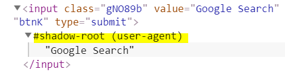

# 딥다크한 어둠의 공간 Shadow DOM

- \<input type="file">  : 버튼이랑 글자 이렇게 2개의 HTML 요소 생성

    - HTML 1개를 적었는데 2개가 한번에 생성됨
    
- \<input type="range">, \<progress> 등도 마찬가지

<br>
 

Shadow DOM 
---
- HTML 개발시 코드가 너무 복잡해지지 않기 위해 숨겨놓은 HTML 요소들

- 아무나 볼 수 없음

- 섀도우를 보려면 크롬 개발자도구 셋팅 변경 필요

    - 개발자도구를 켠 상태에서 F1 (혹은 Settings 메뉴)

    - Show user agent shadow DOM 체크

<br>

|개발자도구 셋팅|
|-|
||


<br>

|input 태그 버튼(특정 요소) 검사|
|-|
||
|내부에 화살표가 생기면서 input 내부에 숨겨진 div 박스나 텍스트들 확인 가능|


<br>

---

<br>
 

Shadow DOM 활용법
---
- shadow DOM을 잘 활용하면 커스터마이징 할 수 없었던 요소들도 커스터마이징 가능

    - \<input placeholder="안녕하세요"> 의 경우

        - 회색글씨가 input 안에 생성됨

        - 회색 글씨의 스타일을 바꾸고 싶다면 shadow DOM 확인

<br>

|placeholder shadow DOM 확인|
|-|
||
|- \<div>들(숨겨놓은 shadow DOM)이 여러개 생성되어있음<br>- 이 중에 회색 텍스트 찾아서 스타일 지정|


<br>

### shadow DOM 선택
- 찾을 때 pseudo라는 속성이 부여되어있다면 pseudo-element 사용

> css
```css
input::-webkit-input-placeholder {
  color : red; 
}
```
- 기존에 보이지 않았던 shadow DOM 요소들도 스타일을 줄 수 있음

    - 스크롤바

    - 드래그시 하이라이트되는 파란색 색상

    - 파일 업로드 버튼


<br>

 
---

<br>
 
-webkit- 수식어
---
> css
```css
input::-webkit-input-placeholder {
  color : red; 
}
```
- 크롬, 오페라, 사파리, Edge 브라우저에서만 동작하는 스타일을 만들고 싶을 때 사용

    - 파이어폭스는 -moz-

    - 익스플로러는 -ms-

<br>

### 💡 주의
- input::-moz-input-placeholder ⇒ 파이어폭스용 스타일을 줄 수 있을까?

    - shadow DOM 스타일 예측은 틀릴 때가 많음

    - 파이어폭스 브라우저로 똑같이 shadow DOM 확인해야 제대로된 스타일을 줄 수 있음

<br>

---

<br>

개발자도구에서 셀렉터를 가져오기
---

|셀렉터 확인|
|-|
||

- shadow DOM에 있는 요소 중 하나를 선택해 개발자도구 하단 CSS 부분에 user agent stylesheet 확인

    - 브라우저 기본 스타일

- 표기된 ::pseudo~ 셀렉터를 그대로 복사해 CSS 파일에 넣고 스타일 넣어도 OK

<br>

---

<br>
 

\<progress> 태그 스타일링
---
- 진행상황을 알 수 있는 progress 바를 html 태그 하나 만으로 생성 가능

> html
```html
<progress value="0.4"></progress>
```
- value 란에 0부터 1사이의 숫자 기입

    - 얼마나 진행되었는지 표시 가능

- \<progress> 태그 자체에 스타일링하려고 해도 스타일이 먹지 않음

    - shadow DOM 확인 후 정확히 스타일 지정

<br>

<details>
    <summary>progress CSS 예시</summary>

<br>

> css
```css
progress {
  /*기본 배경은 없애주는게 좋습니다*/
  -webkit-appearance: none;
  -moz-appearance : none;
  appearance: none;
  background: white;
/* IE10 호환성용 */
  color: red;
}
progress::-webkit-progress-bar {
  background-color: #eee;
  border-radius: 2px;
}
progress::-webkit-progress-value {
  background-color: red;
  border-radius: 2px;
}

/*파이어폭스 호환성을 위해*/
progress::-moz-progress-bar {
  background-color: red;
  border-radius: 2px;
}
```

</details> 

<br>