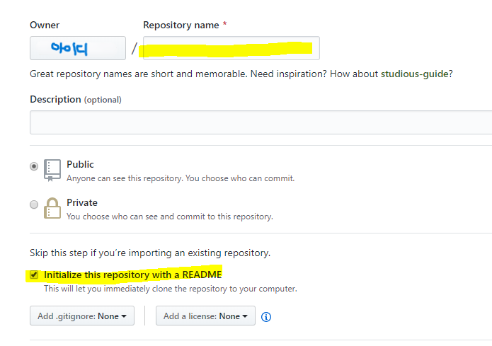
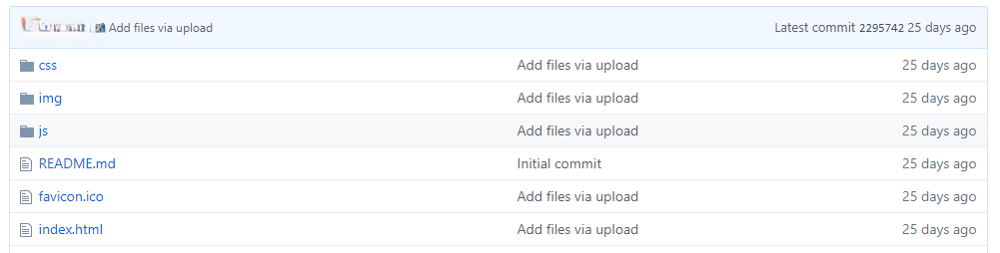

# 만든 사이트 발행하기
 
- html css js 밖에 없는 사이트 발행 방법 2개

    - Github Pages 이용 (누구에게 보여줄 포트폴리오가 빠르게 필요할 때)

    - 일반 유료 호스팅 이용

- 그 외 Vercel, Netlify 이런 곳들도 빠르게 html css js 배포 가능

 

## 01. Github Pages 이용

 

### 1. github.com 가입 및 로그인

 

### 2. 우측 상단 + 버튼 → New repository 

|과정2|
|-|
||

 

### 3-1. repository name : 왼쪽에 뜨는 아이디.github.io
- 임의로 다른 이름으로 적으면 실패

 

### 3-2. README 파일생성란 체크 → 초록버튼

 
|과정3|
|-|
||
 
 
 

### 4. html,css,js 파일 업로드
- 원하는 파일들을 전부 한번에 드래그 앤 드롭

|과정4|
|-|
||
||
 

 

### 5. 업로드가 잘 되었으면 사이트 발행 성공
- 아이디.github.io 주소로 접속하면 사이트 나옴

    - 안뜨면 5~10분 기다려보거나 아이디.github.io/index.html 접속

 

### 6. 웹사이트들은 기본 주소로 들어가면 index.html 파일 자동 노출
- 다른 html 파일을 열람하고 싶다면 html 파일 경로 기재

    - layout.html 보여주고 싶으면 아이디.github.io/layout.html 접속

  

 

### 7. HTML/CSS 변경해 파일을 업데이트 했다면 업데이트한 파일 다시 업로드

 

### 8. 문제가 생겼다면 repository 삭제후 재생성

 
 
 

### 9. 설정에서 구매한 도메인도 등록 가능

 

---

 
 

## 02. 일반 호스팅 이용

|cafe24|
|-|
||

### 1. 가장 많은 유저가 있는 [cafe24.com](https://hosting.cafe24.com/)에서 웹호스팅 선택 후 결제

- 보통 PHP + 리눅스 환경 제공

- 설치비 5천원, 월 500원 (SSD 추천)

 
 
 
### 1-1. 결제시 DB아이디, 비밀번호 설정부분 메모

 
 
 

### 2. 결제 후 관리자 화면 입장 
- 로그인 후 "나의 서비스 관리" 클릭 

 

 

 

### 3. 서비스 접속정보 → FTP 접속정보 확인

- 해당 주소로 접속해서 HTML 파일을 업로드

 
|관리자 화면|
|-|
||
 
 

### 4. FTP 주소로 접속(FTP 프로그램 이용)
- 알FTP 혹은 Filezilla 프로그램 다운받아 설치
 
 
 
### 5. Filezilla 실행 → 빈칸 작성 → 연결

|Filezilla|
|-|
||

- 호스트(FTP 주소)

- 사용자명(FTP 아이디)

- 비밀번호(DB비번)

- 포트 번호(21)

 
 

### 7. 사이트 접속 주소 확인

|관리자 화면|
|-|
||

- 관리자 페이지 → 도메인 연결관리 확인

    - ~.cafe24.com 형태

 
 
 

### 8-1. 나만의 도메인을 설정하고 싶다면 도메인 구입
- name.com 등
 
 

### 8-2. 어떤 사이트에서 도메인을 사든 간에 결제하면 도메인 관리페이지가 활성화됨

 
 

### 8-3. name.com 도메인 관리페이지
- 네임서버(NS) 등록하기 페이지

    - 네임서버들을 cafe24 네임서버로 변경

        - cafe24 네임서버 : cafe24 관리자 페이지 어딘가에 숨겨져있음

 
 

### 8-4. cafe24 관리자 페이지
- 도메인 연결관리에서 구매한 도메인 등록

    - 4시간 정도 기다리면 그 도메인으로 접속가능

 
 

9) 여러개 html 페이지가 있을 경우 각각 접속 방법

- 브라우저 주소창에 URL 기재

    - 경로를 / 기호로 적어주면 접속 가능 

        - 도메인.com/index.html

        - 도메인.com/layout.html 

 
 

 