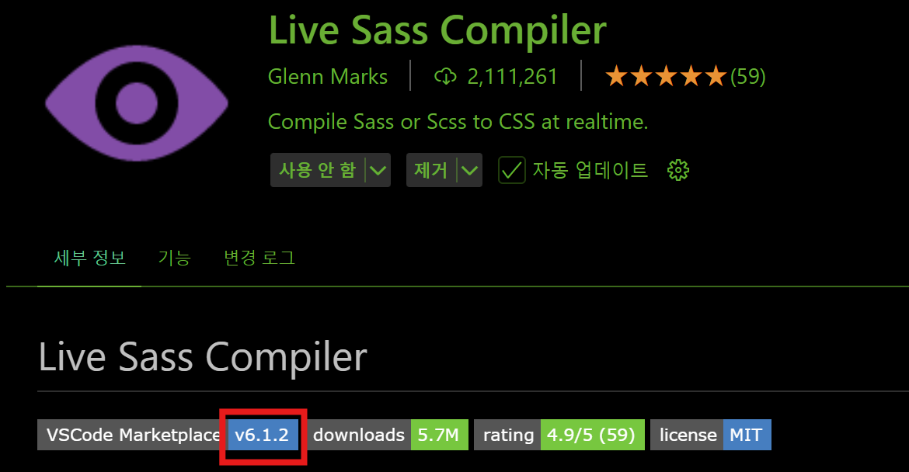
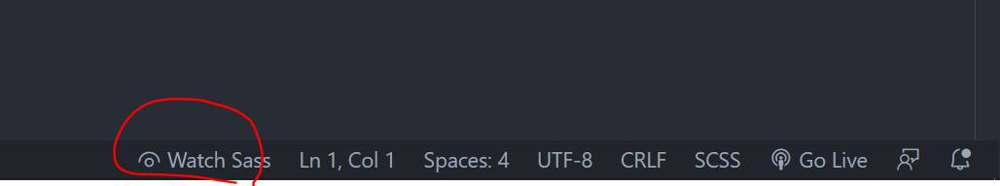

# Sass 셋팅

Preprocessor(전처리언어)
---
- 매우 원시적인 언어인 CSS

    - 스타일만 넣는 언어

    - CSS가 몇천줄이 넘어간다면 CSS 관리 자체로도 큰 부담 발생

- 위와 같은 상황에서 여러가지 문제들의 해결 방안으로 개발됨

- Sass

    - CSS를 조금 더 프로그래밍 언어스럽게 작성할 수 있는 문법들 제공

    - 프로그래밍스러운 변수, 함수, import, 상속 등의 기능을 CSS에서 이용가능

        - 반복적인 부분 쉽게 처리 가능

        - 큰 프로젝트에서 특히 
        
    - .map 파일의 용도 : 크롬 개발자도구 디버깅용

<br>

전처리 언어인 Sass 사용을 위한 개발환경 셋팅
---
- 웹브라우저는 CSS 파일만 해석 가능

    - SASS 로 코드를 짰으면 그걸 CSS 파일로 변환해주는 변환기 필요

    - 변환된 CSS 파일을 HTML 파일과 사용

- 변환하려면 node.js 설치 후 터미널에서 npm init,  install

    - 에디터 이용시 더 쉽게 셋팅 가능

<br>

<details>
<summary>VScode 에디터 활용</summary>

<br>

### 1. VScode 에디터 설치 

<br>
 

### 2. 좌측의 extension 메뉴
- Live sass compile 검색해서 높은 버전 설치(5.0.0 버전 이상)

|-|
|-|
||

<br>
 

### 3. 하단에 Watch Sass 버튼생성 확인 후 클릭
- 작성한 SASS 파일을 자동으로 CSS 파일로 변환

- 하단 바가 안보이면 View - Appearance - Status bar 

|-|
|-|
||


<br>

### 4. 코드는 scss에 짜고, html 에는 css 파일 연결

</details> 


 
<br>

---

<br>

SASS 문법 1 : 값을 저장해놓고 쓰는 '변수' 
---
- CSS로 색상 지정할 때 #2a4c6e 이런 컬라코드 사용

    - 외우기 힘들고 복붙해야함

- SASS 파일에선 이런 어려운 값들을 쉬운 값으로 치환해서 사용 가능

- 변수 : 어려운 값들을 간단한 단어에 저장해서 쓸 수 있게 도와주는 문법

<br>

> test.sass
```scss
(test.scss)
$메인색상 : #2a4c6e;
$서브색상 : #333333;

.text {
  color: $메인색상
}
.box {
  background: $서브색상
} 
```
- test.scss 파일 생성

    - SASS 파일은 파일 확장자가 .scss로 끝나면 됨

- $기호를 사용해 변수명 작명, 거기에 저장할 값을 오른쪽에 기재

    - $변수명 쓸 때마다 어려운 값이 그 자리에 남음

- 예시 : #2a4c6e 값을 $메인색상으로 저장

    - 이제 #2a4c6e 이 색이 필요할 때 마다 $메인색상 호출

- width, font-size 등 자주 쓰지만 기억하기 어려운 값들을 넣으면 편리

- $변수명 : 영어, 한글 OK 

- 많은 곳에서 공통적으로 사용하는 값들도 변수 사용

    - 나중에 변경이 쉬워짐 

<br>

> 상황 예시
```
여기저기 적용중인 사이트 메인 색을 #2a4c6e -> #444444 변경해야할 때

- 색상코드만 붙여넣기식으로 개발했다면 
    - 색을 전부 일일이 찾아서 변경해줘야 함

- 변수 사용했다면
    - 변수정의만 $메인색상 : #444444; 로 바꾸면 다른 곳도 바뀜
```

<br>

---

<br>

사칙연산 가능
---
> test.scss
```scss
$기본사이즈 : 16px;

.box {
  font-size : $기본사이즈 + 2px;
  width : (100px * 2);
  height : (300px / 3)
}
```
- 진짜로 연산해줌

    - 덧셈뺄셈

        - 단위 맞춰줘야 함
    
        - px 단위는 px 단위끼리, % 단위는 % 단위끼리

    - 곱셈 나눗셈
    
        - 보통 뒤에 단위를 쓰지 않음 
        
        - 단위 쓰면 이상한 자료형이 됨 

        - 괄호 안에 작성해야 잘 작동

- 파일 저장해보면 CSS로 자동변환해준 파일에서 그 결과 확인 가능

 
<br>

### 💡 SASS없이 CSS 파일에도 var() 이용해 변수문법 사용가능


<br>

### 💡 CSS 파일에서도 calc() 함수 이용하면 사칙연산 사용가능

 
<br>
 

 


