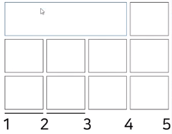
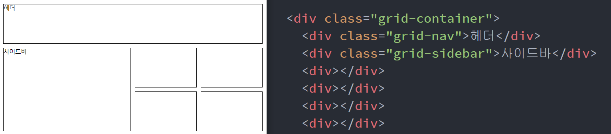

# CSS Grid 레이아웃
Grid 레이아웃 호환성
---
- IE 10 이상에서 동작한다고 나와있으나 표준 문법이 아닌 옛날 문법으로 작성해야 동작

    - IE에서는 불가능, Edge 포함 기타 최신 브라우저에서 사용가능한 속성

- CSS 속성의 브라우저 호환성에 대한 정보는 caniuse.com에서 검색

 

<br>

---

<br>

간단한 Grid 레이아웃 만들기 
---
- Grid 레이아웃 : 격자를 만드는 레이아웃 

> html
```html
<div class="grid-container">
    <div></div>
    <div></div>
    <div></div>
    <div></div>
    <div></div>
    <div></div>
    <div></div>
</div>
```

> css
```css
.grid-container {
  display: grid;
  grid-template-columns: 1fr 1fr 1fr 1fr;
  grid-template-rows: 100px 100px 100px;
  grid-gap: 10px;
}
 ```
- 부모<div>에 display : grid 주면 자식 <div>들은 전부 격자 진열됨

    - grid-template-columns : 격자의 열 너비와 갯수

    - grid-template-rows : 격자의 행 높이와 갯수 설정

    - fr 단위 : 몇배만큼 차지할지를 나타내는 값

- 격자 만드는 이유

    - 격자 그려놓으면 레이아웃 만들기 편해짐


<br>

---

<br>

grid로 레이아웃 만드는 방법
---
### 1. 자식 div 높이와 폭을 조정
- 직접 자식에게 명령을 주어 몇 칸을 차지할지를 정해주기

> html 
```html
<div class="grid-container">
    <div class="grid-nav">헤더</div>
    <div class="grid-sidebar">사이드바</div>
    <div></div>
    <div></div>
    <div></div>
    <div></div>
    <div></div>
    <div></div>
    <div></div>
    <div></div>
</div>
```

> css
```css
.grid-nav {
  grid-column : 1 / 4;
  grid-row : 2 / 4;
}
```
- 자식 div박스 한개를 조금 크게 키우고 싶다면

    - 자식이 몇개의 컬럼과 row를 차지할지 표시

- grid-column : 몇개의 컬럼을 차지할지 설정

    - grid-column : 1 / 4 ⇒ 1부터 4까지를 다 차지해라는 명령

        - 숫자는 grid의 column에 존재하는 세로선들을 의미

- grid-row : 몇개의 row를 차지할지 설정


|숫자 의미|
|-|
||

 
<br>
 

### 2. 자식에게 이름쓰고 부모가 배치
- 약간 더 직관적인 방법

- 자식에 이름을 써놓고 부모가 자식을 자유롭게 배치 

> html
```html
<div class="grid-container">
    <div class="grid-nav">헤더</div>
    <div class="grid-sidebar">사이드바</div>
    <div></div>
    <div></div>
    <div></div>
    <div></div>
    <div></div>
    <div></div>
    <div></div>
    <div></div>
</div>
```

> css
```css
.grid-nav {
  grid-area: 헤더;
}

.grid-sidebar {
  grid-area: 사이드;
}

.grid-container {
  display: grid;
  grid-template-columns: 1fr 1fr 1fr 1fr;
  grid-template-rows: 100px 100px 100px;
  grid-gap: 10px;
  grid-template-areas: 
    "헤더 헤더 헤더 헤더"
    "사이드 사이드 . ."
    "사이드 사이드 . ."
}
```
- grid-area 속성을 이용해 자식에게 '헤더' 와 '사이드' 로 이름 부여

- 부모에게 속성을 추가

    - grid-template-areas : 차지 영역 정하는 명령

        - 자식중에 '헤더'라는 이름을 가진 애가 있다면 첫 행에 4칸을 차지

        - 자식중에 '사이드바'라는 애가 있으면 둘째 행에 2칸, 셋째 행 2칸 차지

 

 
<br>

|결과|
|-|
||


- 큰 레이아웃을 잡을 때보다는 자잘한 부분에서 엑셀같은 격자가 필요할 때 쓰면 효과적 

<br>
 

 

 